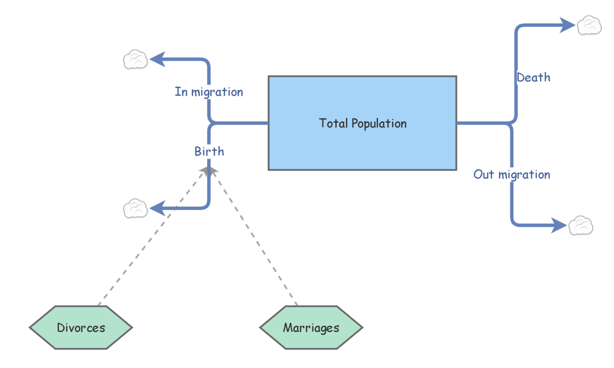
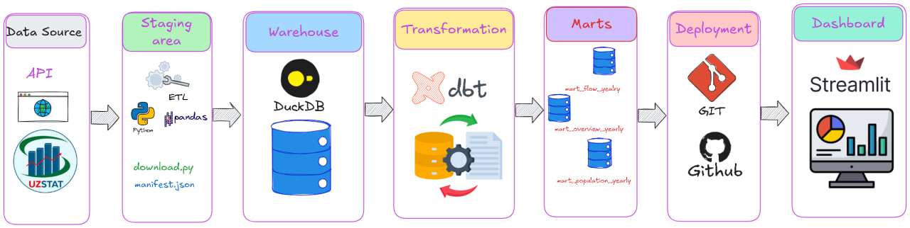
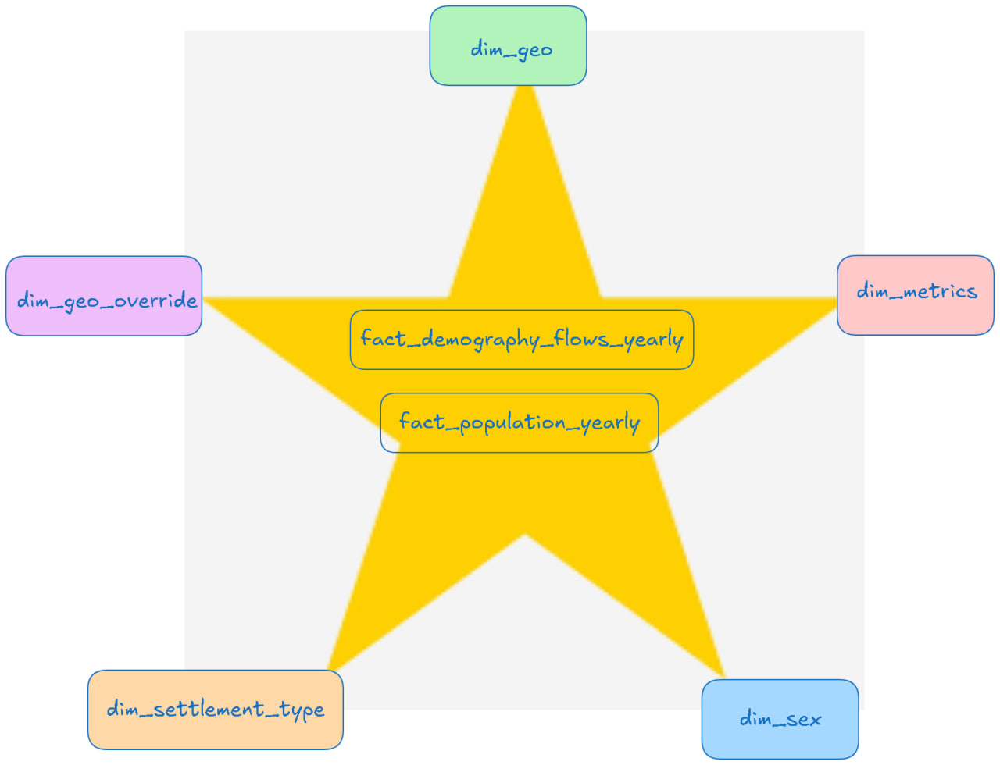

# Namangan Demography — Analytics Engineering Project

> **O'zbekiston ochiq statistikasidan qayta ishlatiladigan analitik dataset va dashboard-ready martlar**
> Manbа: SIAT SDMX · Viloyat: Namangan (geo_code `1714%`) · Davr: 2010–2024
## Architecture








## Links

- [Dashboard](https://app-9oa8mwwxa6kxj9nbkznjvt.streamlit.app/)
- [dbt Docs](https://dbt-demography-docs.vercel.app/)
---

## Loyiha maqsadi

Davlat statistika portali (siat.stat.uz) ma'lumotlarini statik PDF summarylardan **qayta ishlatilishi mumkin, tekshirilishi mumkin bo'lgan** analitik formatga o'tkazish:

- Yagona metrik definitsiyalari (conformed dimensions)
- Audit izlari (dataset_id, source traceability)
- Data quality va qamrov tekshiruvlari
- Takrorlanuvchi ingestion + dbt transformatsiyalar

---

## Ko'rsatkichlar (2010–2024)

| Guruh | Ko'rsatkichlar |
|---|---|
| **Aholi (stock)** | jami, erkak, ayol *(ayol 2014 dan)*, shahar, qishloq |
| **Tug'ilish (flow)** | jami, qizlar, o'g'illar |
| **Vafot (flow)** | jami, ayollar, erkaklar |
| **Migratsiya (flow)** | kiruvchi, chiquvchi (jami) |
| **Nikoh (flow)** | jami, shahar, qishloq |
| **Ajralish (flow)** | jami, shahar, qishloq |

---

## Ma'lumot manbalari

SIAT SDMX export endpointlaridan yuklab olingan, raw CSV sifatida saqlanadi.

- Fayl nomi: `sdmx_data_<dataset_id>.csv`
- Metrik lug'ati: `dbt/seeds/dim_metric.csv`
- Geo nom override: `dbt/seeds/geo_override.csv`
- Ingestion ro'yxati: `ingest/manifest.csv`

---

## Arxitektura

```
Raw CSV → Staging → Intermediate → Dimensions → Facts → Marts → Dashboard
```

### Qatlamlar

| Qatlam | Model | Vazifa |
|---|---|---|
| **Raw** | `raw.sdmx_data_*` | DuckDB view over CSV files |
| **Staging** | `stg_sdmx_<id>_long` | Wide → Long format, kontrakt: `dataset_id, geo_code, year, value` |
| **Intermediate** | `int_demography_atomic` | Barcha staging lar union + dim_metric join, yagona atom jadval |
| **Dimensions** | `dim_geo`, `dim_sex`, `dim_settlement_type`, `dim_metric` | Conformed dimensions |
| **Facts** | `fact_population_yearly`, `fact_demography_flows_yearly` | Stock va flow faktlari |
| **Marts** | `mart_*` | Dashboard-ready, derived KPIlar bilan |

---

## Loyiha tuzilmasi

```
namangan-demography/
├── ingest/
│   ├── manifest.csv          # dataset id, URL, metrik kalit
│   └── download.py           # raw yuklab olish + .meta.json yozish
├── data/
│   └── raw/
│       └── siat_stat_uz/
│           └── sdmx_data_<id>.csv
├── dbt/
│   ├── models/
│   │   ├── staging/          # stg_sdmx_*_long.sql
│   │   ├── intermediate/     # int_demography_atomic.sql
│   │   ├── dimensions/       # dim_geo.sql, 
│   │   ├── facts/            # fact_population_yearly.sql, fact_demography_flows_yearly.sql
│   │   └── marts/            # mart_*.sql
│   ├── seeds/
│   │   ├── dim_metric.csv    # dataset_id → metric semantics # dim_sex.csv, dim_settlement_type.csv
│   │   └── geo_override.csv  # geo_code → clean name
│   ├── macros/
|   |   ├── bootstrap_raw_views.sql    # raw view generator macro
│   ├── tests/                # data quality tests
│   └── dbt_project.yml
├── dashboard/
│   ├── app.py                # Streamlit dashboard
│   └── data/                 # mart CSV eksportlari
└── README.md
```

---

## Ishlatish

### 1 — Raw data yuklab olish
```bash
python ingest/download.py
```

### 2 — dbt ishga tushirish
```bash
cd dbt
dbt deps
dbt seed          # dim_metric, geo_override
dbt run           # barcha modellar
dbt test          # data quality tekshiruv
```

### 3 — Mart CSV eksport (dashboard uchun)
```bash
python dashboard/export_marts.py
```

### 4 — Dashboard ishga tushirish
```bash
cd dashboard
pip install -r requirements.txt
streamlit run app.py
```

---

## Muhim dizayn qarorlari

### 1. Faqat Namangan (`1714%`) — lekin kengaytirilishi mumkin
Hozirda `dim_geo`, staging, va mart modellarda `where geo_code like '1714%'` filtri mavjud. Boshqa viloyatlar uchun:
1. `ingest/manifest.csv` ga yangi dataset_id larni qo'shing
2. `geo_override.csv` ga yangi geo nomlarini qo'shing
3. `mart_*` modellaridagi prefix filtri `dbt_project.yml` dagi `var` ga o'tkazing

### 2. Missing women flag
`population_women` qamrovi 2014 yildan boshlanadi. `mart_population_split_yearly` da `missing_women_flag = 1` bu holatni belgilaydi. Koeffitsient hisoblashda `nullif()` ishlatilgan.

### 3. Reconciliation diffs
`sex_diff` va `settlement_diff` ustunlari jami va komponentlar yig'indisi farqini ko'rsatadi. Nol bo'lmagan qiymatlar manba definitsiyasi muammosini bildiradi.

### 4. Metrik lug'ati (dim_metric seed)
SDMX `dataset_id` → `metric_key`, `metric_group`, `sex`, `settlement_type` mapping. Yangi dataset qo'shilganda faqat seed qatorini yangilash kifoya.

---

## Ma'lumotlar sifati

`dbt test` quyidagilarni tekshiradi:

- `int_demography_atomic`: `geo_code`, `year`, `metric_key` not null
- `dim_geo.geo_code`: unique + not null
- `fact_demography_flows_yearly.metric_group`: accepted_values
- Referensial yaxlitlik: `sex` → `dim_sex`, `settlement_type` → `dim_settlement_type`

`mart_metric_coverage` jadvali har bir metrik uchun yillar kesimida null qiymatlar ulushini ko'rsatadi.

---

## Stack

| Vosita | Maqsad |
|---|---|
| Python + requests | Ingestion |
| DuckDB | Mahalliy analitik ma'lumotlar bazasi |
| dbt-core + dbt-duckdb | Transformatsiya va test |
| Streamlit + Altair | Vizualizatsiya |

---

## Muallif haqida

Bu loyiha **Analytics Engineering** amaliyotlarini ko'rsatish uchun yaratilgan:
raw ochiq ma'lumotlarni tuzilgan, qayta ishlatiladigan, hujjatlashtirilgan analitik layerga o'tkazish.
